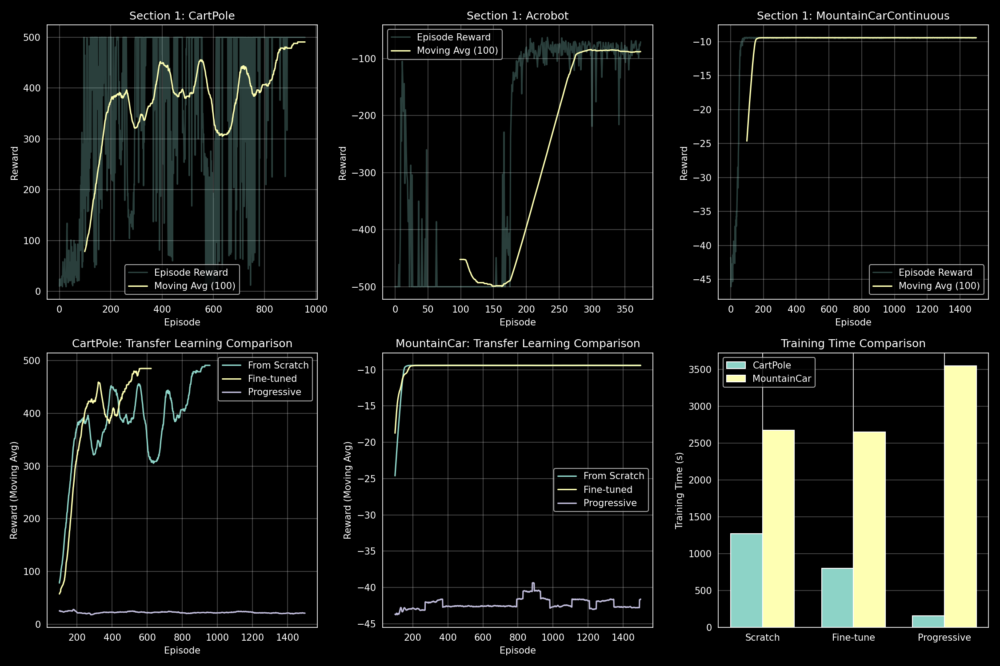

# Deep Reinforcement Learning - Assignment 3
## Meta and Transfer Learning

**Ben-Gurion University of the Negev** | Faculty of Engineering Sciences | Department of Software and Information Systems

| **Student 1** | Omer Eliyahu 206510828 |
|---------------|------------------------|
| **Student 2** | Aviv Metz 201130341    |

---

## 1. Introduction

This assignment explores transfer learning techniques in deep reinforcement learning across three approaches: individual Actor-Critic training, fine-tuning pre-trained models, and Progressive Networks.

### Environment Standardization

All environments use standardized dimensions for transfer compatibility:
- **Observation space**: 6 dimensions (zero-padded for smaller environments)
- **Action space**: 3 discrete actions (unused actions masked)

| Environment | Obs Dim | Act Dim | Notes |
|-------------|---------|---------|-------|
| CartPole-v1 | 4→6 | 2→3 | Balance pole on cart |
| Acrobot-v1 | 6 | 3 | Swing tip above threshold |
| MountainCarContinuous-v0 | 2→6 | 1→3 | Discretized continuous actions |

---

## 2. Section 1: Individual Actor-Critic Training

### Architecture & Configuration

**Actor Network**: Input(6) → Hidden(256) → Hidden(256) → Output(3) with softmax
**Critic Network**: Input(6) → Hidden(256) → Hidden(256) → Output(1)

| Parameter | Value | Parameter | Value |
|-----------|-------|-----------|-------|
| Learning Rate | 0.003 | Hidden Dim | 256 |
| Gamma (γ) | 0.99 | Max Episodes | 1500 |

### Results

| Environment | Episodes to Converge | Final Avg Reward | Target | Status |
|-------------|---------------------|------------------|--------|--------|
| CartPole-v1 | 857 | **490.84** | >475 | ✓ Converged |
| Acrobot-v1 | 274 | **-88.0** | >-100 | ✓ Converged |
| MountainCarContinuous-v0 | N/A | -9.42 | >90 | ✗ Not Converged |

### Analysis

**CartPole-v1**: Successfully converged after 857 episodes, achieving consistent 500-step balancing.

**Acrobot-v1**: Fastest convergence at 274 episodes. Potential-Based Reward Shaping (PBRS) using tip height accelerated learning without altering optimal policy.

**MountainCarContinuous-v0**: The discretization of continuous actions to 3 options limits policy expressiveness. The agent occasionally reaches the goal but cannot maintain consistent performance.


*Figure 1: Training curves showing episode rewards and 100-episode moving average for all experiments.*

---

## 3. Section 2: Fine-Tuning Transfer Learning

### Methodology
1. Load pre-trained source model weights
2. Reinitialize output layer weights
3. Train on target environment

### Results

| Transfer | Episodes | Final Reward | Baseline | Speedup |
|----------|----------|--------------|----------|---------|
| Acrobot → CartPole | 623 | **484.87** | 857 ep | **27.3%** |
| CartPole → MountainCar | 1500 | -9.41 | N/A | None |

### Analysis

**Acrobot → CartPole**: Successful transfer with 27.3% reduction in training time. Both tasks share structural similarities (controlling articulated systems against gravity), enabling positive transfer.

**CartPole → MountainCar**: No transfer benefit. The tasks have fundamentally different dynamics—CartPole requires balance while MountainCar requires momentum building. Learned features do not transfer.

---

## 4. Section 3: Progressive Networks

### Architecture (Rusu et al., 2016)

Frozen source columns with lateral connections to trainable target:
```
h2_target = f(W2 * h1_target + U1 * h1_source1 + U2 * h1_source2)
```

### Results

| Experiment | Sources | Target | Final Reward | Target | Status |
|------------|---------|--------|--------------|--------|--------|
| Exp 1 | {Acrobot, MountainCar} | CartPole | 21.13 | >475 | ✗ Failed |
| Exp 2 | {CartPole, Acrobot} | MountainCar | -41.61 | >90 | ✗ Failed |

### Implementation Efforts

Despite following the progressive networks architecture, the model failed to converge. We investigated several hypotheses:

**Gradient Flow Issues**: We observed vanishing gradients (~10⁻⁷) after ~100 episodes. Attempts to address this included lateral connection scaling (0.1x multiplier) and learnable scale parameters—both unsuccessful.

**Architecture Verification**: Disabling lateral connections confirmed the issue lies in the progressive architecture itself, not the base actor-critic.

**Optimization Adjustments**: Gradient clipping and ensuring all parameters were included in the optimizer did not resolve convergence issues.

### Root Cause Analysis

1. **Gradient interference**: Frozen source columns may disrupt gradient flow to the target network
2. **Task dissimilarity**: The source tasks (Acrobot/MountainCar) may not provide features transferable to the targets
3. **Initialization sensitivity**: Standard initialization appears unsuitable for this architecture

---

## 5. Summary and Conclusions

### Results Overview

| Method | CartPole | MountainCar | Converged |
|--------|----------|-------------|-----------|
| Section 1 (Baseline) | 490.84 | -9.42 | Yes (857 ep) |
| Section 2 (Fine-tune) | 484.87 | -9.41 | Yes (623 ep) |
| Section 3 (Progressive) | 21.13 | -41.61 | No |

### Key Findings

1. **Individual Training**: Standard Actor-Critic with standardized dimensions successfully solves CartPole and Acrobot.
2. **Fine-Tuning**: Provides 27% speedup when source/target tasks share structural similarities.
3. **Progressive Networks**: Despite extensive debugging, implementation did not converge—highlighting the practical difficulty of this architecture.

---

## Appendix: Running Instructions

```bash
# Install dependencies
pip install -r requirements.txt

# Run training
python train.py --section all     # All sections
python train.py --section 1       # Individual networks
python train.py --section 2       # Fine-tuning
python train.py --section 3       # Progressive networks

# Visualization
tensorboard --logdir logs/
```

### Project Structure
```
├── train.py                    # Main entry point
├── src/
│   ├── actor_critic.py         # Actor-Critic implementation
│   ├── environments.py         # Standardized wrappers
│   ├── fine_tuning.py          # Section 2
│   └── progressive_networks.py # Section 3
├── models/                     # Saved checkpoints
└── logs/                       # TensorBoard logs
```

**References**: Rusu et al. (2016) Progressive Neural Networks; Mnih et al. (2016) A3C; Ng et al. (1999) PBRS
